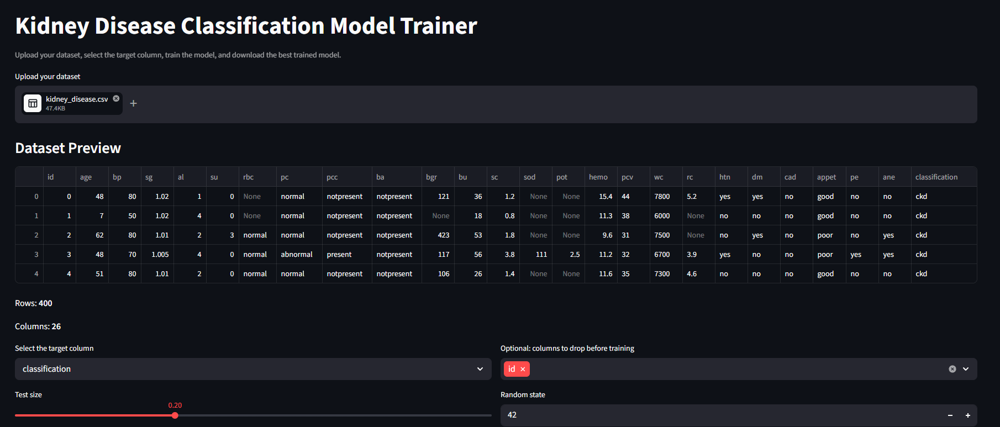
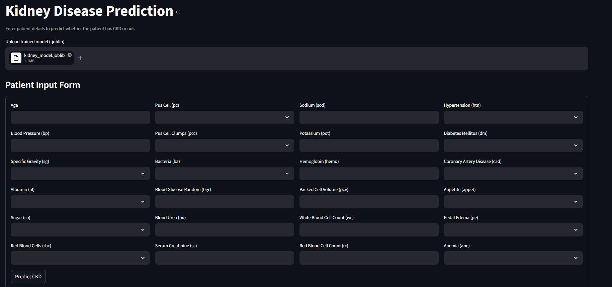

# Kidney Disease Prediction Model

A machine learning web application built with Streamlit to train and predict Chronic Kidney Disease (CKD) using classification models.

## Features

- Upload kidney disease dataset
- Train classification models
- Compare model performance
- Download the best trained model
- Predict CKD or Not CKD from patient input
- Easy-to-use Streamlit interface

## Tech Stack

- Python
- Streamlit
- Pandas
- NumPy
- Scikit-learn
- Joblib

## Project Structure

- `app.py` - training app
- `predict_app.py` - prediction app
- `requirements.txt` - dependencies
- `README.md` - project documentation
- `screenshots/` - application screenshots

## Screenshots

### Training App


### Prediction App


## How to Run Locally

### 1. Clone the repository
```bash
git clone https://github.com/abhi-perera/kidney-disease-predictor.git
cd kidney-disease-predictor